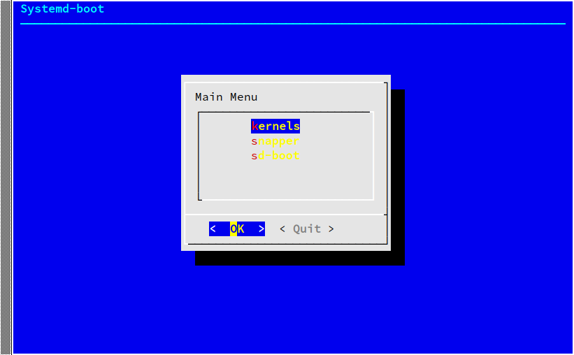
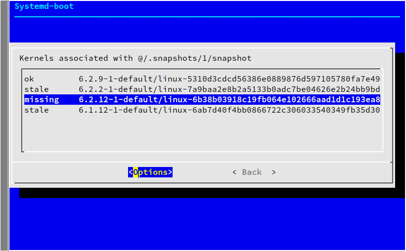
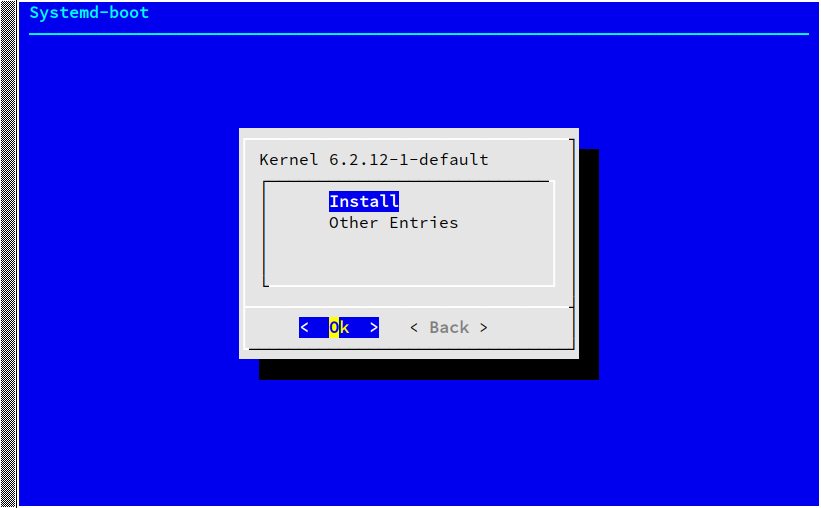
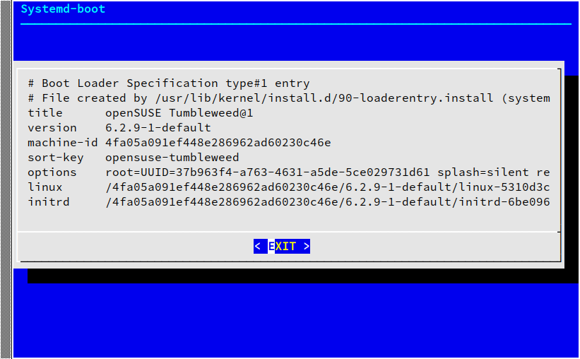
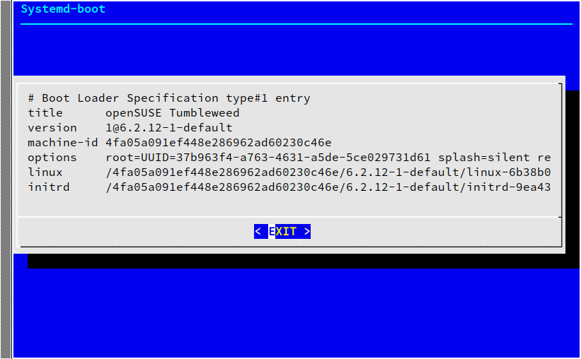
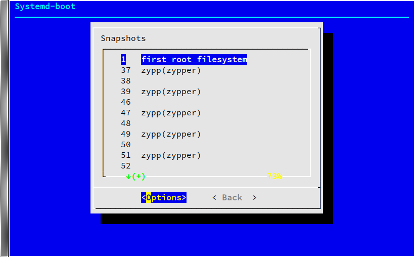
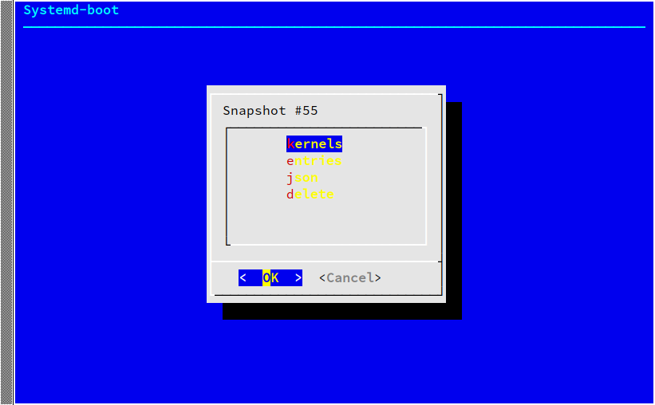
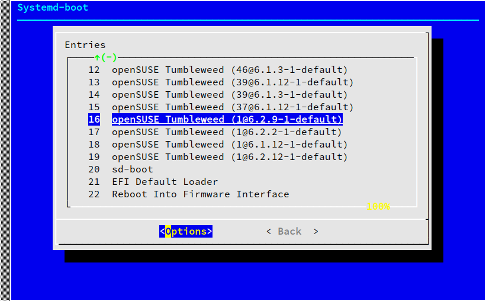
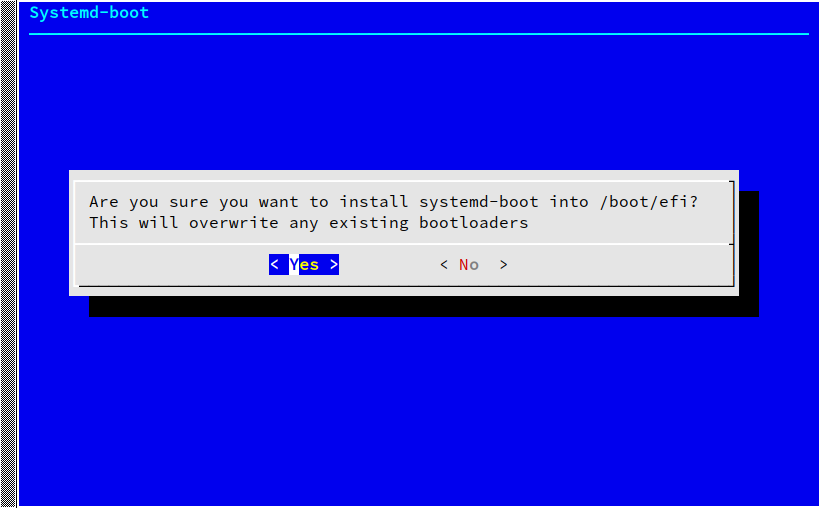
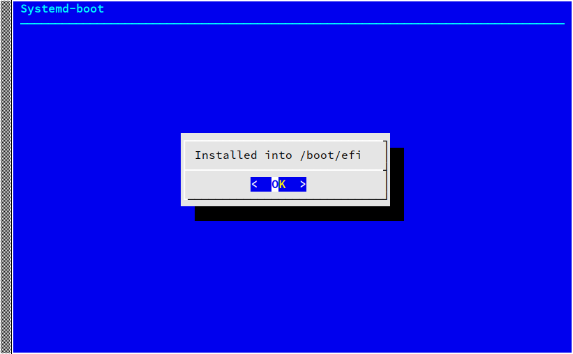

# sdbootutil

**sdbootutil** is a tool designed to manage systemd-boot
in a btrfs based, snapper managed system. It provides
functionality to install systemd-boot with shim, as well
as to install kernels into the ESP. The tool allows for
interactive exploration of kernels, snapshots, and bootloader
entries, and supports a non-interactive mode suitable for
invocation from scripts or triggers.

## Installation

To use sdbootutil, you need to have Rust installed on your system.
The recommended way to install Rust is by using `rustup`,
which works across different distributions and operating systems.

### Installing Rustup

- **On openSUSE:**

  You can install rustup using zypper by running:  
    `sudo zypper install rustup`
  
- **On other Linux distributions, macOS, and Windows:**

  Install rustup by running:  
  `curl --proto '=https' --tlsv1.2 -sSf https://sh.rustup.rs | sh`
  
### Cloning the Repository

Clone the sdbootutil repository using git:  
`git clone https://github.com/TobiPeterG/sdbootutil.git`  
`cd sdbootutil`

## Usage

Make sure you have the required Rust tools installed:  
`rustup default stable`

To compile and run sdbootutil, use Cargo,
the Rust package manager and build system:  
`cargo run`
  
To run the included tests for sdbootutil, you can also use Cargo:  
`cargo test`
  
## Contributing

Contributions are welcome! If you're looking to contribute, please follow these guidelines:

- Make sure your pull requests are based on the latest version of the `rust` branch.
- Do not introduce regressions in code coverage. New functions should be accompanied by corresponding unit tests.
- Ensure that your code follows Rust's idiomatic style and best practices.

## Testing
To facilitate testing, sdbootutil uses `mockall` for creating mock objects.  
Unit tests should be placed in `src/unit_tests/test_FILE.rs`, where `FILE` is the name of the `module` you're testing.  
Remember to include these test modules in the `mod.rs` file.
Make sure the functions, structs, or any other items you want to test are marked as `pub(crate)` at a minimum. This ensures they are accessible within the crate for testing purposes.
Integration tests can be placed in the `/tests` directory at the root of your project. They do not require a special module declaration and can access public items of your crate.

## Screenshots

